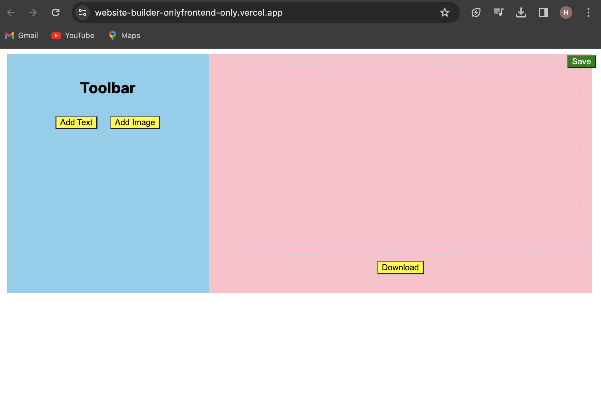

# Internship Assignment - Frontend Development

### Project Overview

> This repository contains the code for the internship assignment, focusing on frontend development using Next.js. The project is a website builder designed to create and customize websites with a frontend-only approach.

### Project URL 

Visit the live deployment of the project:

[ website-builder](https://website-builder-onlyfrontend-only.vercel.app/)

Tech Stack
Next.js: The project is built using Next.js, a React framework for building server-rendered applications.